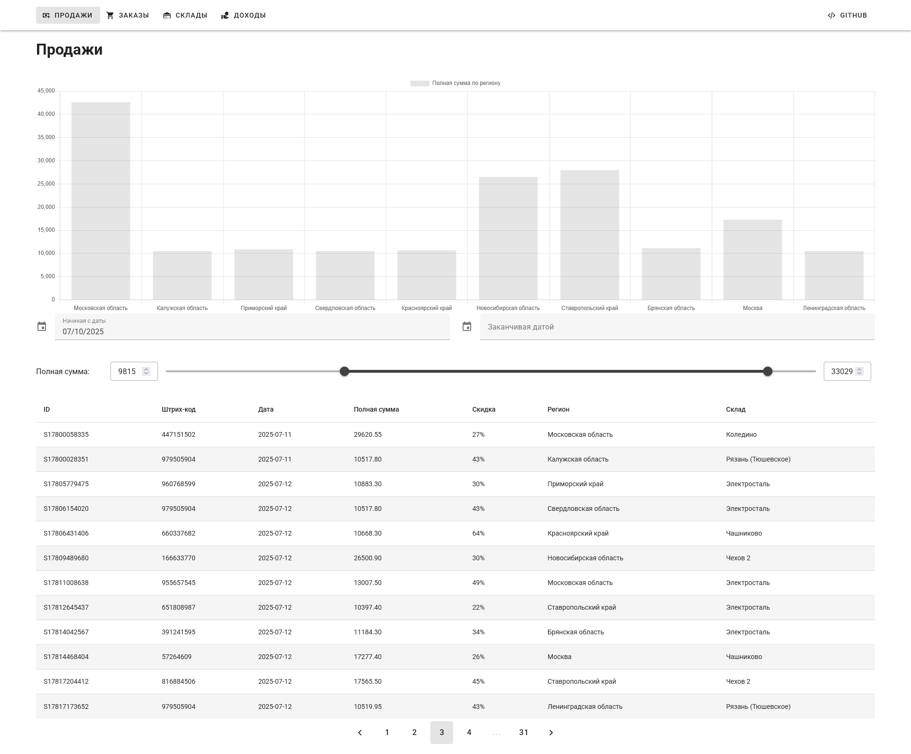
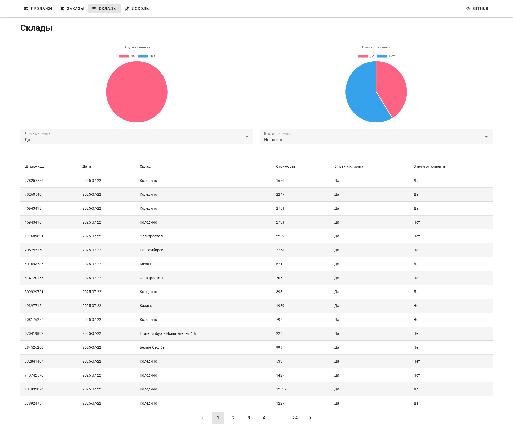

# Elmikeev Test

[**Открыть онлайн**](https://try-again-later.github.io/Elmikeev-Test/)

Там, где можно выбрать промежуток дат, по умолчанию берётся сегодняшний день. Чтобы что-то отобразилось, нужно взять промежуток побольше, выбрав хотя бы вчерашний день в поле "Начиная с даты".

## Запуск локально

```sh
git clone https://github.com/try-again-later/Elmikeev-Test
cd Elmikeev-Test
npm install

# Выставить корректный URL бэкенда в VITE_API_URL и ключ в VITE_API_KEY
cp .env.example .env
npm run dev
```

Приложение будет доступно по адресу [localhost:3000/Elmikeev-Test/](http://localhost:3000/Elmikeev-Test/).

## Скриншоты




